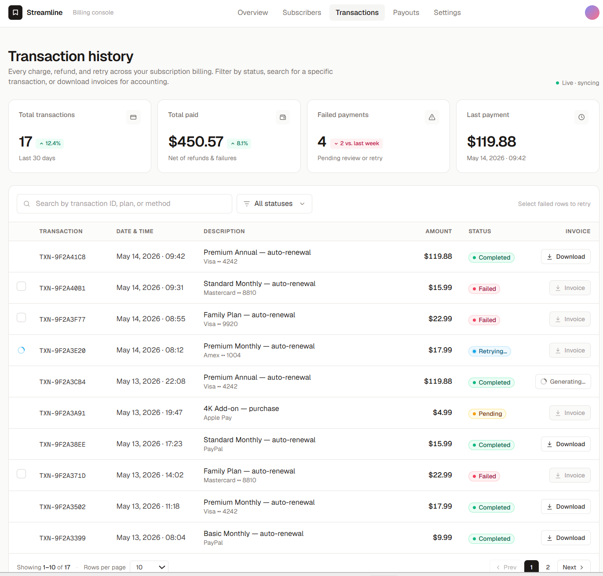

# Transactions Management Dashboard

A subscription transactions dashboard.

Live demo: **[subscription-management-system-ruby.vercel.app](https://subscription-management-system-ruby.vercel.app)**



---

## Features

- Transaction history with ID, amount, date, description and payment method
- Per-row invoice download with simulated PDF generation and toast notification
- Batch retry of failed payments — concurrent API calls with independent per-row loading states
- Search and filter by status
- Virtualized list for performance at scale
- Skeleton loaders, error boundaries, full keyboard accessibility

---

## Tech stack

| Layer | Technology | Why |
|---|---|---|
| Framework | Next.js 15 (App Router) | SSR, Route Handlers as mock API, Vercel-native |
| Language | TypeScript (strict) | Type safety, discriminated unions for status fields |
| Styling | Tailwind CSS + CVA + cn() | Small bundle, full control, variant-safe component API |
| Data fetching | TanStack React Query v5 | Optimistic updates, per-mutation state, cache management |
| Notifications | react-toastify | `toast.promise()` for invoice flow |
| Virtualization | react-virtuoso | Performant rendering of long lists |
| Testing | Playwright | E2E coverage of critical user flows |
| Formatting | Prettier | Consistent code style, format-on-save in VS Code |
| Git hooks | Husky | Enforced commit message convention |
| CI/CD | GitHub Actions | Type check + lint + build on every push |
| Deployment | Vercel | Native Next.js support, preview URLs per PR |

---

## Getting started

### Prerequisites

- Node.js 20+
- npm 10+

### Run locally

```bash
git clone https://github.com/labiejroo/subscription-management-system
cd subscription-management-system
npm install
npm run dev
```

Open [http://localhost:3000](http://localhost:3000)

### Run with Docker

```bash
docker-compose up
```

Open [http://localhost:3000](http://localhost:3000)

### Run tests

```bash
npx playwright install
npm run test:e2e
```

---

## Project structure

```
app/
  layout.tsx                        # root layout, Geist font
  page.tsx                          # main page ('use client')
  loading.tsx                       # Suspense fallback for the page
  globals.css

src/
  components/
    ui/                             # primitives — no business logic
      Checkbox/index.tsx
      icons/index.tsx
      Pagination/index.tsx
      StatusBadge/index.tsx
      Toast/index.tsx
    layout/
      TopNav/index.tsx
    features/
      transactions/
        DataRow/index.tsx
        InvoiceButton/index.tsx
        MobileRow/index.tsx
        StatCard/index.tsx
        StatusFilter/index.tsx
        TableSkeleton/index.tsx
        Toolbar/index.tsx
  hooks/
    useTransactions.ts
    useRetryPayments.ts
    useDownloadInvoice.ts
  lib/
    types.ts                        # shared TypeScript types
    utils.ts                        # cn(), fmtUSD()
    logger.ts                       # observability abstraction
    eng.ts                          # all user-facing copy strings
    mockData.ts                     # seed data (mock)
  providers/
    QueryProvider.tsx
```

---

## Development

### Commit convention

Enforced by Husky. Format: `<type>: <Capital letter message ending with period.>`

Allowed types: `feature` | `bug` | `docs` | `style` | `refactor` | `test` | `chore` | `perf` | `ci` | `revert`

```bash
git commit -m "feature: Add invoice download button."   # ✅
git commit -m "bug: Fix retry count not decrementing."  # ✅
```

### Code formatting

Prettier is configured in `.prettierrc`. Install the [Prettier VS Code extension](https://marketplace.visualstudio.com/items?itemName=esbenp.prettier-vscode) — format-on-save is enabled automatically via `.vscode/settings.json`.

---

## Architecture decisions

### `Promise.allSettled` over `Promise.all` for concurrent retries

When retrying multiple failed payments simultaneously, `Promise.all` throws on the first failure and cancels remaining retries. `Promise.allSettled` lets every payment attempt resolve independently — each row updates its own UI state as it completes, regardless of what happens to the others.

### Next.js Route Handlers as mock API

Instead of a separate backend, Route Handlers in `app/api/` simulate realistic API behaviour — network latency, random failure rates, delayed PDF generation. This keeps the project self-contained and reflects the real production pattern where Next.js acts as a BFF (Backend For Frontend), proxying requests to internal services without exposing credentials to the browser.

### CVA for variant-safe component styling

`class-variance-authority` replaces manual string unions with typed variant maps. Types are derived directly from the cva definition via `NonNullable<VariantProps<typeof variant>['key']>` — so the TypeScript type and the visual implementation are always in sync. Adding a new variant in one place is enough.

### React Query with optimistic updates

Retry mutations use `onMutate` to optimistically update row state, with `onError` rollback if the call fails. Per-row status is tracked in a `Map<string, RetryStatus>` so each row re-renders independently without triggering a full list re-render.

### Observability layer

`lib/logger.ts` is a thin abstraction over `console` that emits structured JSON log events. In production, replace the single `console.info/error` call with `mixpanel.track()`, a CloudWatch `PutLogEvents` call, or any structured logging SDK — no changes required elsewhere in the codebase.

### E2E-only test strategy

Unit tests were deliberately skipped in favour of Playwright E2E tests that cover the same surface area at a higher confidence level.

The critical behaviours in this app — retry flow, invoice download state, checkbox selection, toast notifications — are all the result of several moving parts working together: React Query mutations, optimistic updates, route handlers, and component state. A unit test would have to mock React Query, the fetch layer, and the router, which means the test ends up verifying the mock wiring rather than the actual behaviour.

Playwright hits a real Next.js dev server with real network requests, so a passing test means the full stack actually works.

**If unit tests were added**, the right tool would be [React Testing Library](https://testing-library.com/docs/react-testing-library/intro/) (RTL) with Vitest:
- **Hooks** (`useRetryPayments`, `useDownloadInvoice`) — wrap in `renderHook` with a `QueryClientProvider`, stub `fetch` with `vi.spyOn`, assert on returned state transitions
- **Pure components** (`StatusBadge`, `Checkbox`, `StatCard`) — render with RTL, assert on accessible roles and text
- **MSW** (Mock Service Worker) instead of `vi.spyOn` for more realistic fetch interception without touching implementation details

### react-virtuoso over react-virtualized

`react-virtualized` has not had a major release in years and has limited TypeScript support. `react-virtuoso` is actively maintained, has a smaller API surface, and integrates cleanly with React 18 concurrent features.

---

## CI/CD

GitHub Actions runs on every push and pull request:

1. `npm ci`
2. `tsc --noEmit` — type check
3. `npm run lint`
4. `npm run build`

Vercel deploys automatically from `main`. Every pull request gets a unique preview URL.

---

## What I would add in a production project

- **Pagination or infinite scroll** backed by a real API with cursor-based pagination
- **Real observability** — Mixpanel for product analytics, CloudWatch for server-side error tracking
- **Unit tests** for hooks with Vitest + React Testing Library
- **MSW (Mock Service Worker)** to replace Route Handlers in tests — more realistic network simulation
- **OpenAPI spec** (`openapi.yaml`) as a contract between frontend and backend
- **Error boundaries** per section so a failed invoice download does not crash the whole page
- **Rate limiting** on retry endpoint to prevent abuse
